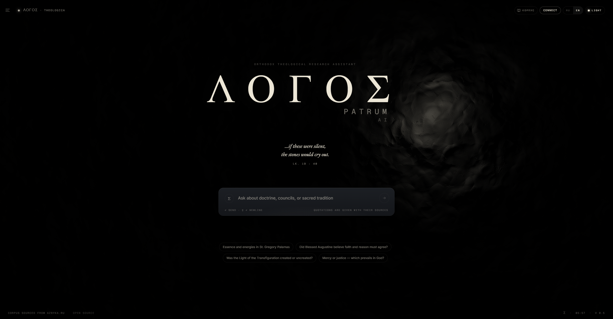

# Logospatrum — Theological Research Assistant



Russian Orthodox patristic chat. Agentic RAG over ~2,100 works / 86 authors /
726K paragraphs / 1.98M embedding windows from azbyka.ru. Two-tier deepagents
graph (Claude Sonnet 4.6 main + Haiku 4.5 search subagent via Timeweb AI),
Postgres 16 + pgvector (semantic) + tsvector (lexical), bge-m3 embeddings,
Next.js 15 frontend.

**Live:** https://logospatrum.com

## What's here

- `apps/backend/` — LangGraph graph + FastAPI catalog/budget endpoints.
- `apps/frontend/` — Next.js 15 chat UI (Logos shell).
- `packages/pipeline/` — corpus ingest CLI (scrape, markdown, chapters,
  paragraphs, embed).
- `plugins/patristic-plugin/` — git submodule → [logospatrum/patristic-plugin](https://github.com/logospatrum/patristic-plugin).
  The Claude Code plugin third-party agents install to use our MCP.
- `infra/` — docker-compose, nginx, migrations.
- `docs/superpowers/{specs,plans}/` — design docs + implementation plans.
- `tests/eval/gold.yaml` — 53-query acceptance set.

## Quick links

- **Connect your agent (MCP):** https://logospatrum.com — click "Подключить"
  in the top bar. Or directly:
  `claude mcp add --transport http patristic https://logospatrum.com/api/mcp`.
- **Plugin repo:** https://github.com/logospatrum/patristic-plugin
- **Backend internals:** [apps/backend/CLAUDE.md](apps/backend/CLAUDE.md)
- **Frontend internals:** [apps/frontend/CLAUDE.md](apps/frontend/CLAUDE.md)
- **Pipeline (data ingest):** [packages/pipeline/](packages/pipeline/)
- **Root project notes:** [CLAUDE.md](CLAUDE.md)

## Local dev

Prereqs: Docker + WSL2 (Windows), Python 3.13, Node 20.

```bash
# Postgres (pgvector)
wsl -e bash -c "cd $(pwd)/infra && docker compose -f docker-compose.dev.yml up -d postgres"

# Backend (LangGraph dev server)
cd apps/backend && PYTHONUTF8=1 .venv/Scripts/langgraph dev --port 2024 --no-browser

# Frontend (note: PORT=3001, not 3000 — see apps/frontend/CLAUDE.md)
cd apps/frontend && PORT=3001 npm run dev
```

## Production deploy

CI (`.github/workflows/build-and-push.yml`) builds + pushes to GHCR on every
push to `master` / tag `v*`. VPS pulls with:

```bash
ssh root@<vps>
cd /opt/logospatrum
git pull
docker login ghcr.io -u $GHCR_USERNAME -p $GHCR_TOKEN   # read:packages PAT
docker compose -f infra/docker-compose.prod.yml pull
docker compose -f infra/docker-compose.prod.yml up -d
```

See `docs/superpowers/specs/2026-05-17-mcp-feature-and-prod-rollout-design.md`
for the full architecture (whitelist API surface, Wolfi-based langgraph-built
backend, MCP-as-public-feature).

## License

MIT.
